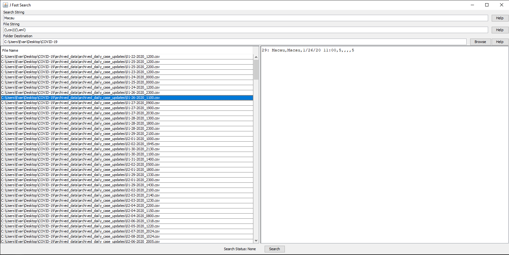

# J-Search
This is a cross platform tool written in java for quick and dirty cross platform file searching.

## Features
* Perform a regex content find for both file names and file line contents.
* Specify, or browse to, a top-level folder destination.

## ToDo
* Copy path clipboard option
* Open in file browser for selected-file.

## Example
